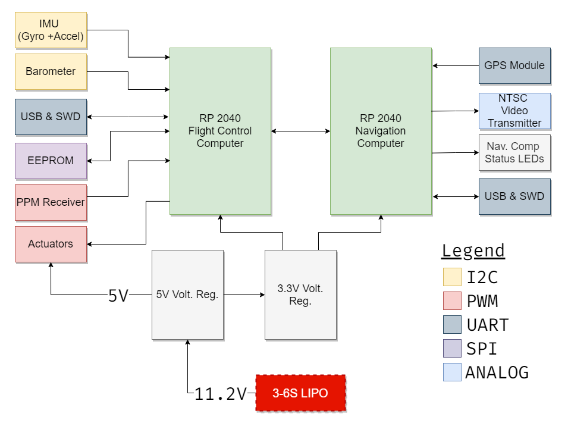

# Overview
Hermes is designed to function as the base flight control system responsible for guidance, navigation and control of a fixed-wing UAV - but general enough for most other vehicles.

## Aims
- Design a complete flight control system from scratch (hardware, software, control systems, navigation algorithms, ground control station, etc..)
- <b>Goal</b>: Complete system consisting of standardised hardware and basic but robust software framework.
- <b>Focus on developing and testing novel algorithms - not writing low-level code!</b>

## Hardware Requirements
- Standard set of sensors (e.g. IMU, barometer, ..)
- Expansion and interface capabilities via various IOs.
- Power distribution for servos.
- Processing power.
- <b>Affordability!</b>

## Hardware Specification
### Bill of Materials 
|  S/N   | Component                   | Qty | Description  | Unit Price (CAD) | Price (CAD) |
|  --:   | :--                         | :-: | :--          | :--   | :--   |
|   1    | <b>RP2040</b>               |  2  | <b>Flight Control Computer</b>: Main MCU for polling IMU and Radio PPM for control loop  <b>Navigation Computer</b>: Secondary MCU handling onboard guidance & navigation algorithms + extras| $1.45 | $2.90 |
|   2    | <b>Invensense MPU6050</b>   |  1  | 6DOF MEMS IMU (Gyroscope + Accelerometer)  | $3.50 | $3.50 |
|   3    | <b>NXP MPL3115A2</b>        |  1  | Absolute pressure sensor with an I²C digital interface  | $3.50 | $3.50 |

### Datasheets
- [<b>RP2040</b>](https://datasheets.raspberrypi.org/rp2040/rp2040-datasheet.pdf)
   - Dual ARM Cortex-M0+ @ 133MHz
- [<b>MPU6050</b>](https://datasheet.lcsc.com/lcsc/1811071024_TDK-InvenSense-MPU-6050_C24112.pdf)
   -  6-axis MotionTracking device that combines a 3-axis gyroscope, 3-axis accelerometer, and a Digital Motion Processor™ (DMP)
- [<b>MPL3115A2</b>](https://www.nxp.com/docs/en/data-sheet/MPL3115A2.pdf)
   - I²C precision pressure sensor with altimetry

### Block Diagram

## Next Steps
A list of a few things to complete:
- [ ] [ 0%] Telemetry and messaging protocol.
- [ ] [ 0%] Aircraft modelling, control system design and implementation.
- [ ] [ 0%] Higher-level firmware (state machine, guidance algorithms, etc.)
- [ ] [50%] Low-level firmware (e.g. device drivers and interfaces).
- [ ] [90%] State Estimation (Madgwick & Kalman filters).
- [X] [100%] Ground control station.

            

Last Updated: <code>Today</code>