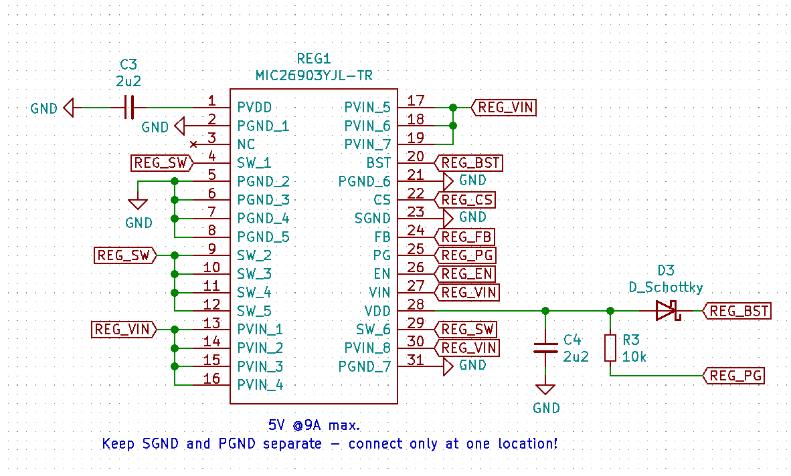
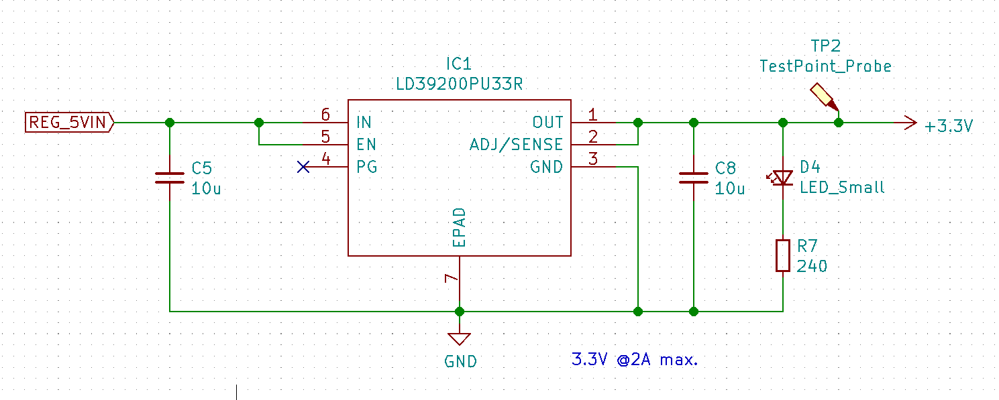

# Power
The main power source for this embedded system is a 3-6S LiPo Battery. Both MCU's are powered via a single 5V USB connection despite needing separate USB connectors to program, this done to aid debugging. 

## Power Requirements
- Step-down LiPo 11.2-26V DC Input to 5V for actuators 
- Supply both MCU's with 3.3V from either USB_VBUS or VCC.

## Battery & 5V Power Supply
To step down 11.2V from the LiPo Battery to 5V a DC/DC Buck Regulator rated to a max. of 28V is needed. The <b>Micrel MIC26903</b> is used to supply 5V @ 8A to all the actuators and 3.3V regulators. 

|  | 
|:--:| 
| *Figure 1: Battery * |

|  | 
|:--:| 
| *Figure 2: Buck Regulator input filtering * |

|  | 
|:--:| 
| *Figure 3: Buck Regulator  * |

|  | 
|:--:| 
| *Figure 4: Buck Regulator output filtering  * |

## 3.3V Power 
Both USB ports are connected to a LDO providing 3.3V @2A to both MCU's and their peripherals.

|  | 
|:--:| 
| *Figure 5: Solder-jumper for LiPo 5V input * |

|  | 
|:--:| 
| *Figure 6: 3.3V Low Dropout Voltage Regulator (LDO)  * |