# Technical Documentation

This MCU is responsible for polling IMU sensors at a high-rate, listening for incoming radio commands and actively stabilizing the aircraft about a desired setpoint.<br/>
The <i>Flight Control Computer</i> (<b>FCC</b>) is based on the RP2040 microcontroller clocked @ 133MHz this is fast enough to run the external PID control loop as well handle all the calculations needed for reliable attitude estimation.<br/>


## PCB View

import SVGImages from "./svg.js"

<SVGImages/>

## Interactive BOM

:::info
An interactive BOM to aid in assembly can be found [<b>here</b>](pathname:///static/ibom.html)
:::

## Hardware Design

The <b>Flight Control System</b> consists of:

- [Power](technical_docs#power)
  - [Requirements](technical_docs#requirements)
  - [Battery & 5V Power Supply](technical_docs#battery--5v-power-supply)
  - [3.3V Power ](technical_docs#33v-power)
- [Crystal Oscillator](technical_docs#crystal-oscillator)
  - [Load capacitance calculation](technical_docs#crystal-oscillator)
- [Flash Storage](technical_docs#flash-storage)
- [MCU](technical_docs#mcu)
- [Sensors](technical_docs#sensors)
- [Radio](technical_docs#radio)
- [Before First Boot](technical_docs#before-first-boot)
- [Resources](technical_docs#resources)


:::note
The datasheets for all the components used can be found [<b>here</b>](overview#datasheets)
:::

### Power
The RP2040 chip requires two different voltage supplies 3.3V (for I/O's) and 1.1V (for the chips digital core).
The main power source for this embedded system is a 3-6S LiPo Battery. Both MCU's are powered via a single 5V USB connection despite needing seperate USB connectors to program, this done to aid debugging.

#### Requirements

- Step-down LiPo 11.2-26V DC Input to 5V for actuators
- Supply both MCU's with 3.3V from either USB_VBUS or VCC.

#### Battery & 5V Power Supply

To step down 11.2V from the LiPo Battery to 5V a DC/DC Buck Regulator rated to a max. of 28V is needed.<br/>The <b>Micrel MIC26903</b> is used to supply 5V @ 8A to all the actuators and 3.3V regulators.

| 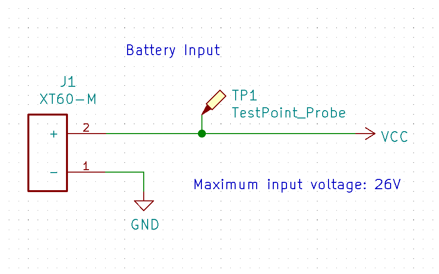 |
| :------------------------------: |
|       _Figure 1: Battery _       |

| 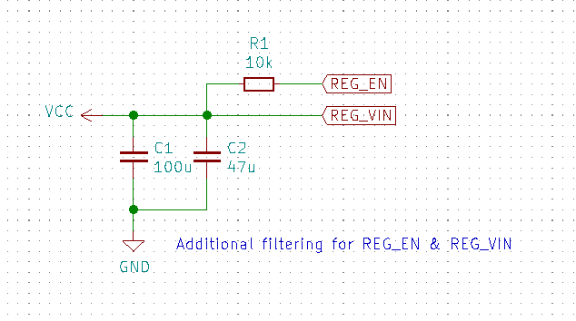 |
| :-----------------------------------------------------------: |
|          _Figure 2: Buck Regulator input filtering _          |

| 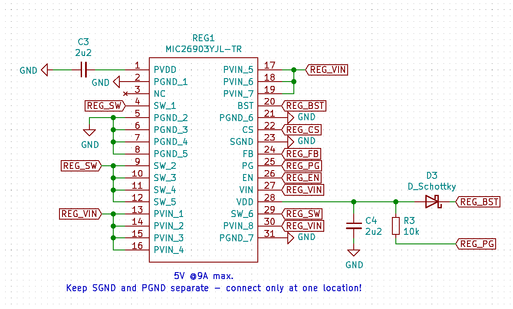 |
| :----------------------------------------: |
|        _Figure 3: Buck Regulator _         |

| 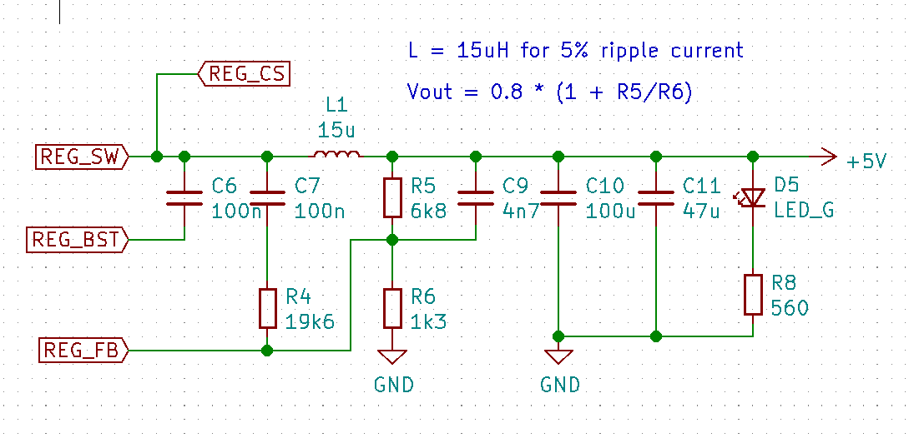 |
| :---------------------------------------------------------------: |
|           _Figure 4: Buck Regulator output filtering _            |

#### 3.3V Power

Both USB ports are connected to a LDO providing 3.3V @2A to both MCU's and their peripherals.

| 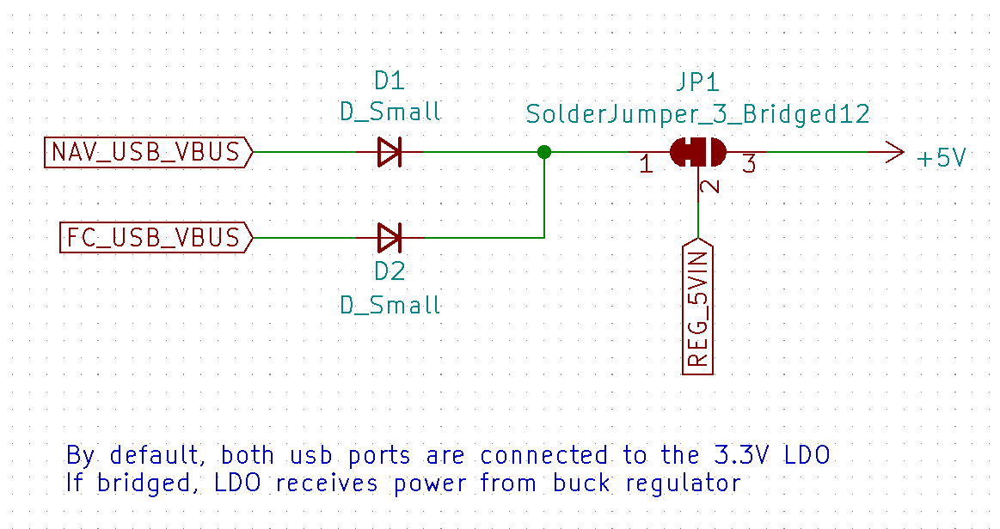 |
| :-------------------------------------------------------: |
|       _Figure 5: Solder-jumper for LiPo 5V input _        |

| 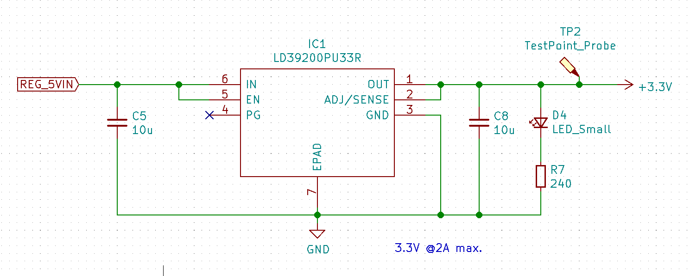 |
| :----------------------------------------------------------------: |
|       _Figure 6: 3.3V Low Dropout Voltage Regulator (LDO) _        |

### Crystal Oscillator
#### Load capacitance calculation
$$
\tag{i} C_{L_{ext}} = \frac{C_{L1}\times C_{L2}}{C_{L1}+C_{L2}}+C_{S}
$$
Where $C_{S}$ is the stray capacitance in the oscillator circuit, and can be estimated to 5pF.<br/>
The external resistor value can than be calculated by the following formula:<br/>
$$
\tag{ii} R_{ext} = \frac{1}{2\pi fC_{L_{ext}}}
$$
| 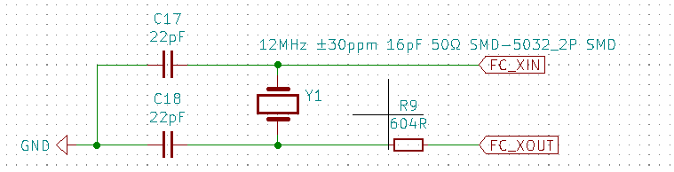 |
| :----------------------------------------------------------------: |
|       _Figure 7: 12MHz 16pF Crystal Oscillator _        |

### Flash Storage
In order to be able to store program code which RP2040 can boot and run from, we need to use a flash memory, specifically, a quad SPI flash memory. The device chosen here is an W25Q128JVS device, which is a 128Mbit chip (16Mbyte). This is the largest memory size that RP2040 can support.

| 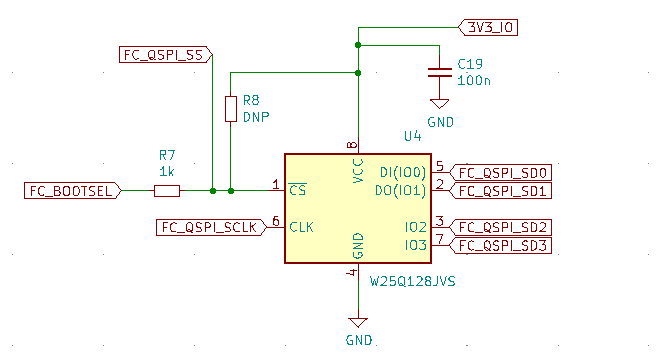 |
| :----------------------------------------------------------------: |
|       _Figure 8: W25Q128JVS 128Mbit flash (16Mbyte) _        |

### MCU
RP2040 is a 56 pin, 7x7mm QFN (Quad Flat No-leads) package with a small pitch (0.4mm pin-to-pin spacing).

| 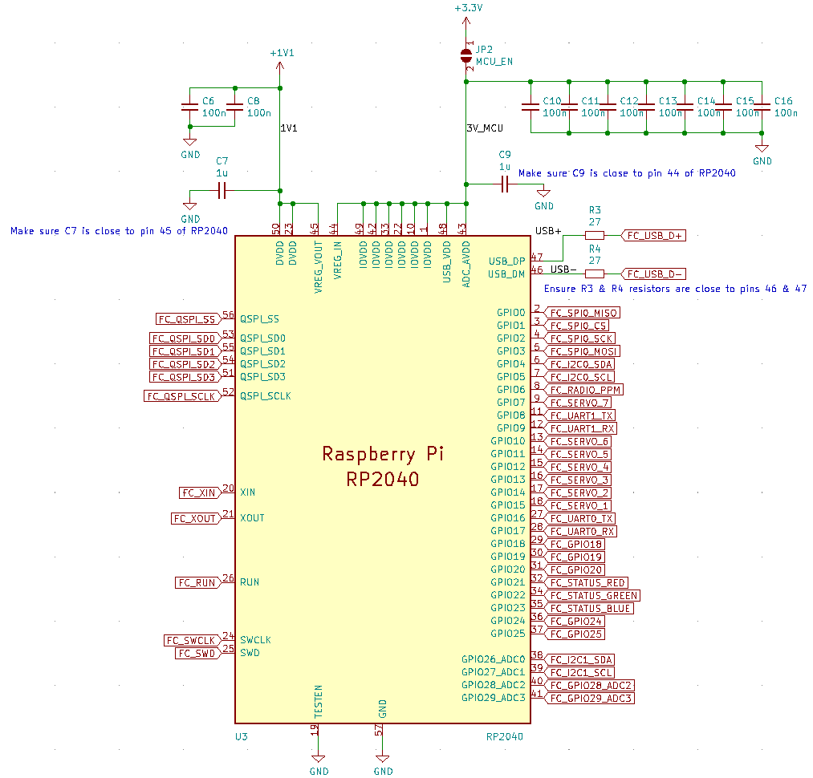 |
| :----------------------------------------------------------------: |
|       _Figure 9: RP2040 _        |

### Sensors
Invensense MPU6050 is the accelerometer/gyroscope sensor.<br/>
NXP MPL3115A2 is the barometric pressure sensor chosen to estimate altitude.

| 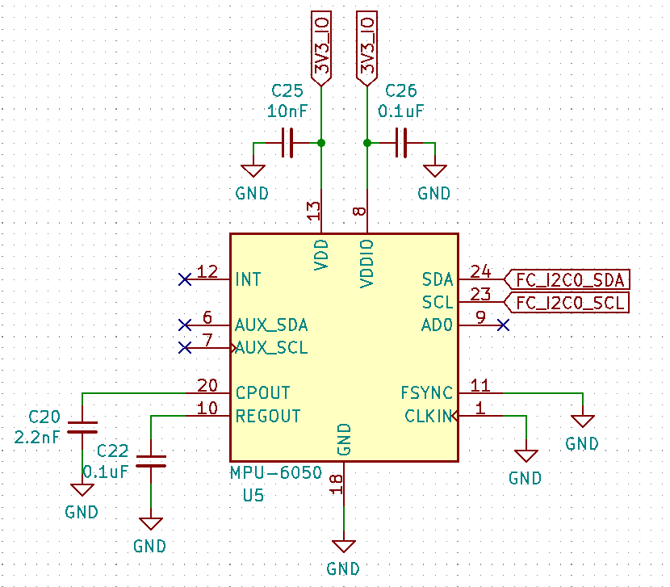 |
| :----------------------------------------------------------------: |
|       _Figure 10: Invensense MPU6050 _        |

| 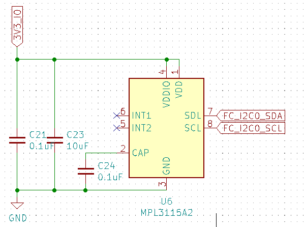 |
| :----------------------------------------------------------------: |
|       _Figure 11: NXP MPL3115A2 _        |

### Radio
The Flysky FS-iA10B receiver is used to receive RC control input signals via PPM. <br/>
Get the Flysky FS-iA10B [here](https://www.amazon.ca/Flysky-FS-iA10B-Compatible-Transmitter-Quadcopter/dp/B07FVBYJJ2) <br/>

```c title="radio.h"
// PPM Timing constants
uint32_t ppm_delta = 0;
uint32_t ppm_prev = 0;
uint32_t MIN_PPM_DELAY_BETWEEN_PACKETS = 5000; //usec
uint32_t MAX_PPM_DELAY_BETWEEN_CHANNELS = 500; //usec
int PPM_CHANNEL_INDEX = 0;
int prev_idx;
bool PPM_START = false;
// 8 Channels for FS-iA10B PPM-Output Setting. check 'config.h'
uint32_t PPM_PACKET[NUM_PPM_CHANNELS] = {};

void ppm_callback(uint gpio, uint32_t events){

    ppm_delta = time_us_32() - ppm_prev;
    ppm_prev = time_us_32();
    // Decode PPM Signal
    if (ppm_delta > MIN_PPM_DELAY_BETWEEN_PACKETS){
        PPM_START = true;
    }
    else if (ppm_delta < MAX_PPM_DELAY_BETWEEN_CHANNELS){
        if (PPM_START){
            PPM_CHANNEL_INDEX = 0;
            PPM_START = false;
        }
        else{
            //sanity check
            if (ppm_delta){ 
                PPM_CHANNEL_INDEX++;
                if (PPM_CHANNEL_INDEX > NUM_PPM_CHANNELS - 1){
                    PPM_CHANNEL_INDEX = 0; // Reset index to zero 
                }
            }
        }    
    }
    else{
        PPM_PACKET[PPM_CHANNEL_INDEX] = ppm_delta;
    }
}

void init_radio(){
    gpio_set_irq_enabled_with_callback(PPM_PIN, GPIO_IRQ_EDGE_RISE | GPIO_IRQ_EDGE_FALL, true, &ppm_callback);
}
```
| 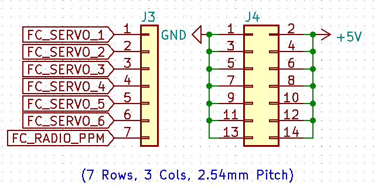 |
| :----------------------------------------------------------------: |
|       _Figure 12: Connectors _        |


### Before First Boot
After assembling all the components.
Solder jumper JP2 & JP3 only after ensuring 3.3V is the nominal voltage.<br/>
This supplies power to the MCU and peripheral components (eg. Sensors and Flash)

| 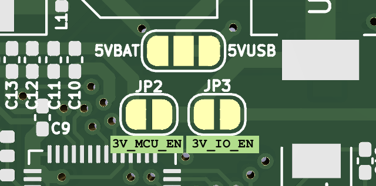 |
| :----------------------------------------------------------------: |
|       _Figure 13: Bridge 3V_MCU_EN & 3V_IO_EN pads _        |

import VideoPlayer from './technical.js'

After soldering JP2 & JP3, it is safe to power the board and begin flashing firmware. <br/>
Below is a brief video showing the FC booting and completing it's LED boot sequence.

<VideoPlayer url="https://youtu.be/Anb_hUl2xqM"/>

### Resources
All Design files and resources can be found [here](https://github.com/RaymondBello/KICAD-PCBs/tree/main/Hermes/hermes_v1)

<!--
Let $F:[a,b]\to\R$ be $F(x)=\int_{a}^{x}f(t)dt$.


```jsx live
function Clock(props) {
  const [date, setDate] = useState(new Date());
  useEffect(() => {
    var timerID = setInterval(() => tick(), 1000);

    return function cleanup() {
      clearInterval(timerID);
    };
  });

  function tick() {
    setDate(new Date());
  }

  return (
    <div>
      <h2>It is {date.toLocaleTimeString()}.</h2>
    </div>
  );
}
``` -->
